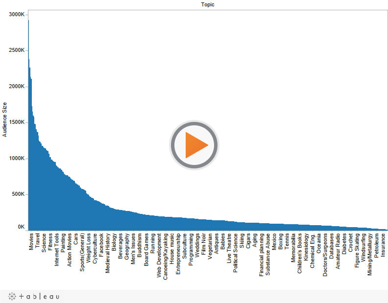
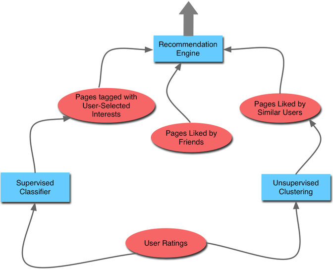

```{r setup, include=FALSE}
knitr::opts_chunk$set(echo = TRUE)
```

<hr>

## **A. Background**

> **<a href = "https://www.stumbleupon.com/", target="_blank"><b>StumbleUpon</b></a>** is a content-discovery and recommender engine for web-based media.
>
> According to their website: "StumbleUpon connects you to new and interesting webpages personalized to you."
>
> In this assignment, I performed a scenario design analysis on the company and its users, researched how the platform works, and provided suggestions for improving its recommender system.

<hr>

## **B. Scenario Design Analysis**

### **Target Users**

>Target users for StumbleUpon are people with ample disposable time and a basic level of tech-literacy -- which means they are likely young.


### **Organization Analysis**

#### 1. What are their key goals?

>StumbleUpon aims to keep people Stumbling for as long as possible in order to maximize the number of eyes looking at paid advertisements.


#### 2. How can the platform help them accomplish their goals?

>The platform makes it as easy as possible -- and rewarding as possible -- to keep Stumbling. The call-to-action in the top bar is prominent and the paid advertisements are often hard to distinguish from real content.


### **User Analysis**

#### 1. What are their key goals?

> Users primarily come to StumbleUpon for entertainment, and to discover new content.

#### 2. How can the platform help them accomplish their goals?

> Users have control over the content they see. They can set preferences for categories and topics of interest when they sign up. Additionally, they can skip through content they find boring at any time, even ads, leading to a feeling of real "discovery" through the use of the site.

<br>

<hr>

## **C. How StumbleUpon Works**

### **User Flow**

> StumbleUpon users designate **"interests"** -- or preferences for content -- through broad categories and narrower topics.

 

<br>

> These interests form the basis of **"Stumbling"** -- the method of discovering content using StumbleUpon's engine. Users Stumble using the **Stumble bar**, which is at the top of every page in the site.
>
>Each time users click on the "Stumble" button, they are taken to a new page with content or an advertisement. Users can then bookmark the page, indicate a "like" / "dislike", or share it. Ads appear roughly <a href = "https://marketingland.com/stumbleupon-quietly-becomes-profitable-as-advertisers-flock-to-mobile-friendly-native-ads-59276", target="_blank">1 out of every 20 times</a> that users click on "Stumble".

 

<br>

> Every "like" that users give pages are stored in the user's profile and used to improve both their recommendations and the recommendations of other users with similar interests.

 

<br>

### **Long Tail**

> Like in many recommender systems, we see a <a href = "https://www.portent.com/blog/social-media/visualizing-the-stumbleupon-audience.htm", target="_blank">"Long Tail"</a> of user interests on the platform -- a small selection of topics are extremely popular, while the rest are more "niche" and popular with fewer and fewer users. 



<br>

> This means that StumbleUpon has an incentive to show content on popular topics more often compared to unpopular ones, which may or may not align with its supposed selling point of content "discovery".

<br>

### **Collaborative Filtering**

> StumbleUpon uses a <a href = "https://en.wikipedia.org/wiki/StumbleUpon", target="_blank"><b>collaborative filtering</b></a> recommender system, which filters content based on the recommendations of other users. 

> Concrete information on how StumbleUpon's collaborative filtering system actually works is scarce (and probably proprietary). However, the user Doug on <a href = "https://stackoverflow.com/questions/7471018/architecture-essential-components-of-stumbleupons-recommendation-engine", target="_blank"><b>this StackOverflow page</b></a> provides a helpful theory.

> In Doug's diagram below, pink ovals are data sources, and blue rectangles are predictive algorithms. 
>
> - StumbleUpon has **three sources of data**: (1) pages tagged with user-selected interests, (2) pages liked by friends, and (3) pages like by similar users.
>
> - User ratings in the form of page likes and dislikes train a **supervised classifier model** that categorizes pages by topic.
>
> - User ratings also train an **unsupervised clustering model**, which groups users by similarity of likes and dislikes.
>
> - These two algorithms, along with pages liked by the user's friends, create sources of data that feed into a recommendation engine, which then provides users with content.



<br>

<hr>

<br>

## **D. Recommendations**

> StumbleUpon has a sophisticated recommender system based on many data sources. To better meet the goals of users looking to "discover" new content, however, I wonder if StumbleUpon could intentionally skew the interests featured on the site towards the long end of the long tail -- that is, show less-popular topics more often. 
>
>This is risky strategy since it subjects users to content outside of their strongest interests, which could frustrate and/or bore them after a while. However, it may also create more meaningful experiences of true "discovery" -- and push people out of their filter bubble.
